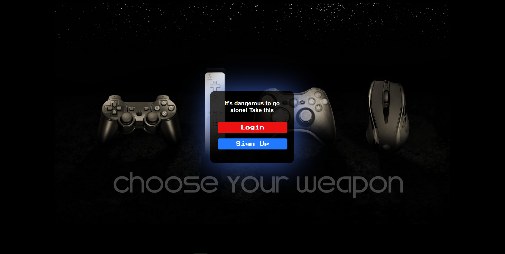
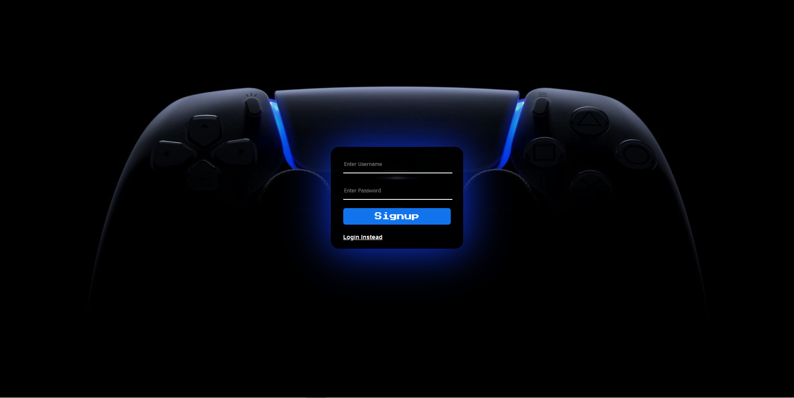
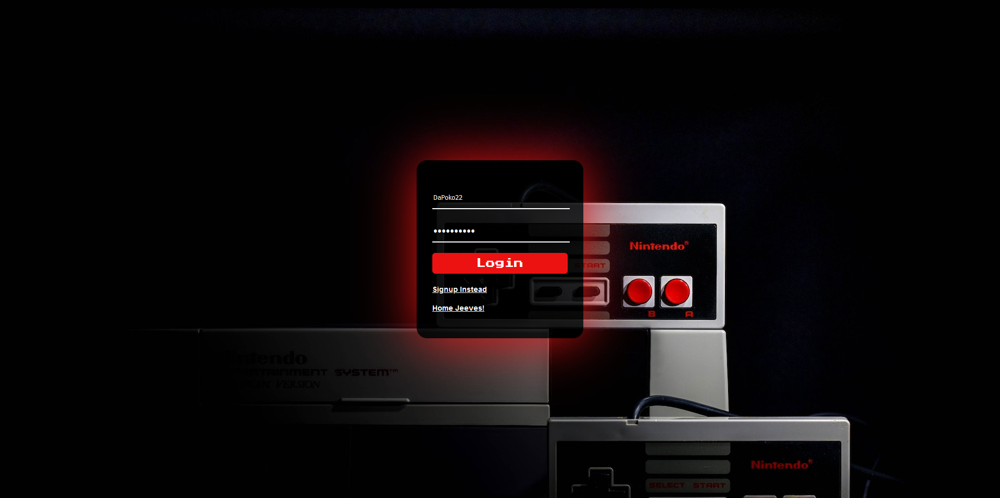
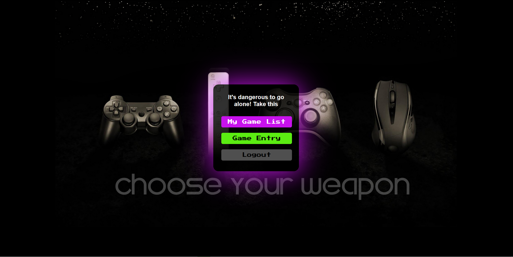
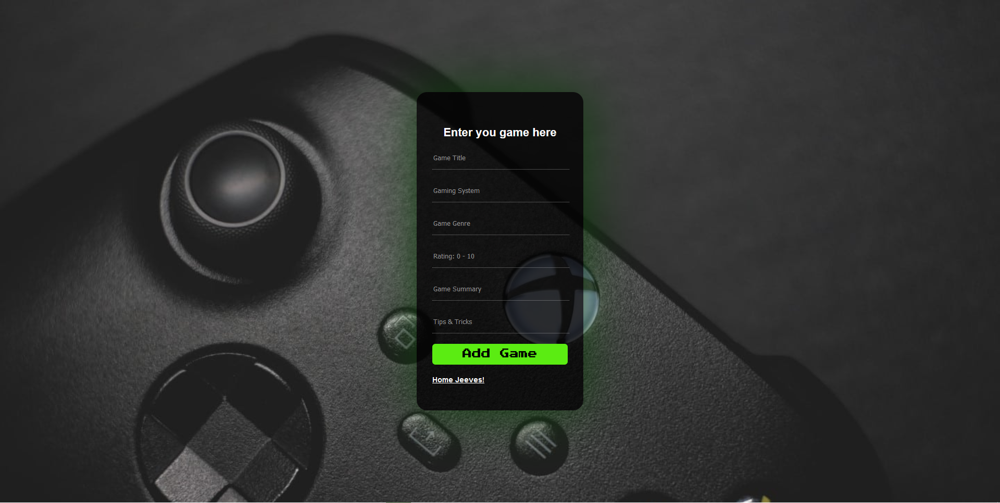
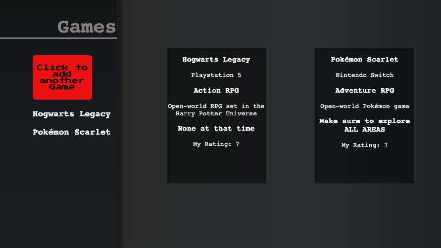

# 
### Table of Contents
- [Technologies Used](#technologies-used)
- [Coding Badges](#coding-badges)
- [Link to Application](#link-to-live-application)
- [Description](#description)
- [Local Installation](#installation)
- [App Screenshots](#screen-shots)
- [License](#license)
- [How to Contribute](#how-to-contribute)
---
## Technologies Used


[Back to Top](#table-of-contents)

## Coding Badges


[Back to Top](#table-of-contents)

---
# [Link to Live Application](https://estee3-tech-blog.herokuapp.com/)

[Back to Top](#table-of-contents)

----
## Description

This project was created by four student looking to make an easy way for you to keep track of your favorite games in a single place where you can rate them, comment on them and look back on tips and tricks. 

[Back to Top](#table-of-contents)

---
---
# Local Installation
1. Download or clone this repo to your local machine
2. Create an `.env` file in the root of the directory (within your IDE of choice)
 - Copy/paste the following code into the .env file you created, changing the password to be your MySQL root password:
 ```
  DB_NAME = 'gaming_db'
  DB_USER = 'root'
  DB_PW = 'password'
 ```
3. Update the `'password'` within that file, to be your MySQL root password
4. Launch a terminal from the root of the same folder
5. Enter `npm install` to install all required packages and wait for them to complete
6. Log into MySQL by entering `mysql -u root -p`, followed by entering your password
7. Enter `source db/schema.sql` to source the Database to your MySQL instance
8. Enter `use gaming_db` to change the in-use Database to "ecommerce_db"
9. Enter `exit` to go back to the standard terminal prompt
10. If you'd like to seed the DB tables with example data, enter `npm run seed`, followed by `npm start`, Otherwise just enter `npm start` to initialize and launch the server with a clean slate!
11. Navigate to [http://localhost:3001](http://localhost:3001) in your internet browser of choice and enjoy!

[Back to Top](#table-of-contents)

---
## Creators

The four contributers to this project were 

<li>Mark Battaglia</li>
<li>Bryan Bohling</li>
<li>Srinivasa Yedla</li>
<li>Benjamin Espino</li>

[Back to Top](#table-of-contents)

---
## Screen Shots



---


---


---


---


---



[Back to Top](#table-of-contents)

---

# License

MIT License

Copyright (c)

Permission is hereby granted, free of charge, to any person obtaining a copy
of this software and associated documentation files (the "Software"), to deal
in the Software without restriction, including without limitation the rights
to use, copy, modify, merge, publish, distribute, sublicense, and/or sell
copies of the Software, and to permit persons to whom the Software is
furnished to do so, subject to the following conditions:

The above copyright notice and this permission notice shall be included in all
copies or substantial portions of the Software.

THE SOFTWARE IS PROVIDED "AS IS", WITHOUT WARRANTY OF ANY KIND, EXPRESS OR
IMPLIED, INCLUDING BUT NOT LIMITED TO THE WARRANTIES OF MERCHANTABILITY,
FITNESS FOR A PARTICULAR PURPOSE AND NONINFRINGEMENT. IN NO EVENT SHALL THE
AUTHORS OR COPYRIGHT HOLDERS BE LIABLE FOR ANY CLAIM, DAMAGES OR OTHER
LIABILITY, WHETHER IN AN ACTION OF CONTRACT, TORT OR OTHERWISE, ARISING FROM,
OUT OF OR IN CONNECTION WITH THE SOFTWARE OR THE USE OR OTHER DEALINGS IN THE
SOFTWARE.

[Back to Top](#table-of-contents)

---

## How to Contribute

[Contributor Covenant](https://www.contributor-covenant.org/)

[Back to Top](#table-of-contents)
